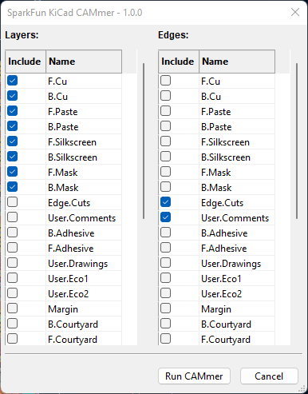
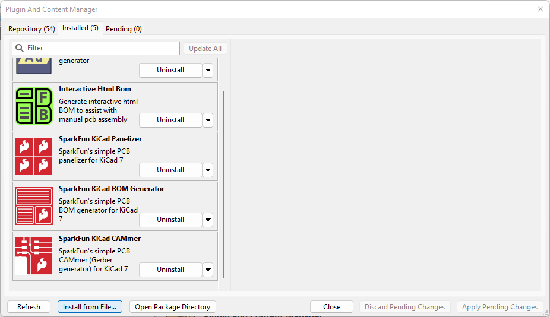
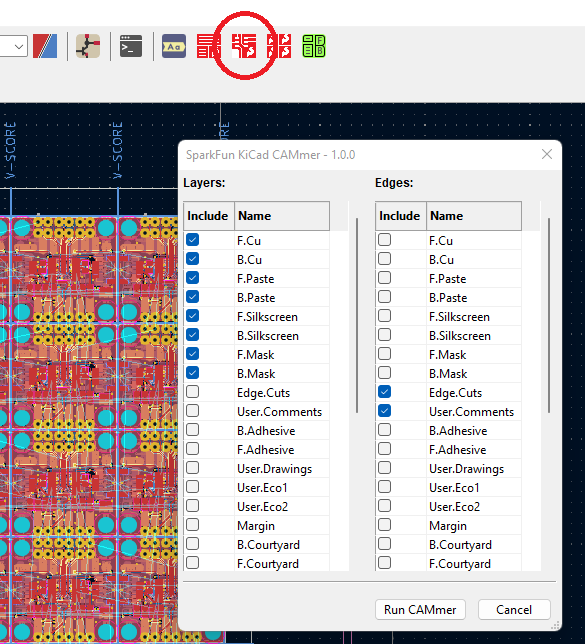
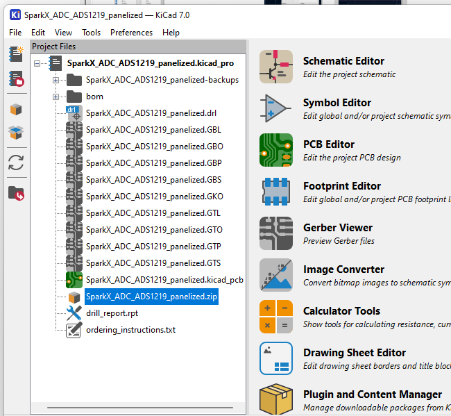

# SparkFun PCB CAMmer plugin for KiCad 7

This plugin generates the Gerber and Drill files for a KiCad PCB.

We've tried to keep this CAMmer simple and easy-to-use, while also including all of the features of the original [SparkFun CAMmer for Eagle](https://github.com/sparkfun/SparkFun_Eagle_Settings/blob/main/ulp/SparkFun-CAMmer.ulp). This plugin:

* Generates and zips the gerber and drill files
* Adds `ordering_instructions.txt` to the zip file, if found
* Will merge multiple layers (E.g. `Edge.Cuts` and `User.Comments`) to generate the board outline
  * The SparkFun KiCad Panelizer places the V-SCORE information in `User.Comments` by default

You can of course use KiCad's built-in **Fabrication Output** tools to do most of the above manually.

## Installation and Usage

Open the KiCad Plugin and Content Manager (PCM) from the main window and filter for `SparkFun CAMmer`.

To install manually, open the [GitHub Repo Releases page](https://github.com/sparkfun/SparkFun_KiCad_CAMmer/releases) and download the `SparkFunKiCadCAMmer-pcm.zip` file attached to the latest release. Then use the PCM _**Install from File...**_ option and select the .zip file to install it. For best results, **Uninstall** the previous version first, **Apply Pending Changes**, and then **Install from File...**.

The CAMmer plugin runs inside the KiCad PCB Editor window. (Although you can run the CAMmer in a Command Prompt too. See [below](#how-it-works) for details.)

Click the CAMmer icon to open the GUI:

We have deliberately kept the GUI options as simple as possible:

* In column 1: select your copper, silkscreen and solder mask layers
  * The CAMmer will select these for you based on the number of copper layers, but you can override if you want to
* In column 2: select which layer(s) will be used to generate the board outline
  * For SparkFun panels, the default is `Edge.Cuts` plus `User.Comments` (the SparkFun KiCad Panelizer places the V-SCORE information in `User.Comments` by default)

Click **Run CAMmer** to run the CAMmer. The Gerber and drill files are created and zipped automatically.

The CAMmer settings are saved in a file called `cammer_config.json` so they can be reused.

`cammer.log` contains useful diagnostic information.

## License and Credits

The code for this plugin is licensed under the MIT license. Please see `LICENSE` for more info.

`cammer.py` is based heavily on the [KiCad code example](https://gitlab.com/kicad/code/kicad/-/blob/master/demos/python_scripts_examples/plot_board.py).

The [wxFormBuilder](https://github.com/wxFormBuilder/wxFormBuilder/releases) `text_dialog.fbp` and associated code is based on [Greg Davill (@gregdavill)](https://github.com/gregdavill)'s [KiBuzzard](https://github.com/gregdavill/KiBuzzard).

## How It Works

The plugin GUI itself is designed with [wxFormBuilder](https://github.com/wxFormBuilder/wxFormBuilder/releases) and stored in `text_dialog.fbp`.
Copy and paste the wx Python code from wxFormBuilder into `./SparkFunKiCadCAMmer/dialog/dialog_text_base.py`.

`.github/workflows/build_asset_release.yml` generates the .zip file containing the plugin Python code (`./plugins`), icon (`./resources`) and the Plugin and Content Manager (PCM) `metadata.json`. The workflow automatically attaches the zip file to each release as an asset. Edit `./SparkFunKiCadCAMmer/resource/_version.py` first and update the version number. `build.py` is called by the workflow, copies `metadata_template.json` into `metadata.json` and then updates it with the correct version and download URL. The version number is also added to the .zip filename. The PCM should automatically download and install new versions of the CAMmer for you.

You can run the CAMmer stand-alone if you want to. Open a **KiCad 7.0 Command Prompt**. On Windows, you will find this in `Start Menu / All Apps / KiCad 7.0`. cd to the `SparkFun_KiCad_CAMmer\SparkFunKiCadCAMmer\cammer` directory. `python cammer.py` will show the help for the arguments. When you run the CAMmer plugin in KiCad, it will generate files for whichever PCB is currently open. When running the CAMmer stand-alone, you need to provide the path `-p` to the PCB.

- Your friends at SparkFun

